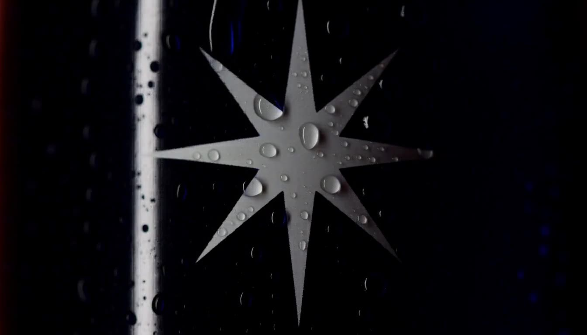
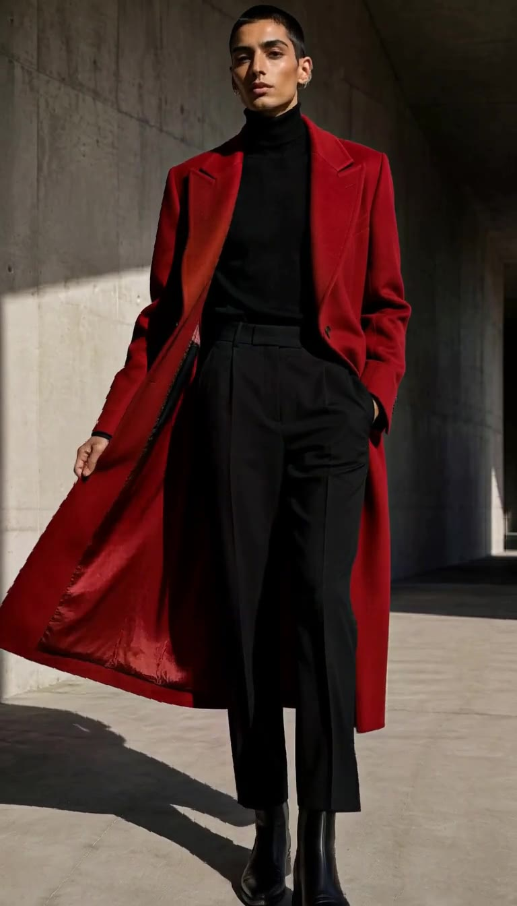

<div align="center">
  

  # OpenMagia

  **A local-first AI video studio with native generation, thoughtful editing, and less software between you and the film.**

  [](#project-status)
  [](#requirements)
  [](https://github.com/antirez/h3.c)
  [](LICENSE)

  [](https://github.com/davidaircloud/OpenMagia/stargazers)
  [](https://github.com/davidaircloud/OpenMagia/issues)

  [Website](https://openmagia.com) · [Why OpenMagia](#why-openmagia) · [What it can do](#one-studio-four-creative-systems) · [Install](#install) · [Contribute](#contributing)
</div>

---

OpenMagia brings generation, storyboarding, character continuity, and real timeline editing into one calm workspace. It runs in your browser, but the creative engine, projects, media, and exports stay on your computer.

Built on [h3.c](https://github.com/antirez/h3.c), OpenMagia runs MiniMax H3 natively on Apple Silicon. There are no accounts, no cloud upload requirement, and no maze of disconnected AI tools.

> **Local by default.** Your footage, references, generations, prompts, timelines, and exports live in a folder you control.

## Why OpenMagia

AI video software is often either a model demo or an overloaded editor. OpenMagia is designed as a product: powerful underneath, quiet on the surface, and careful about the small interactions that determine whether creative work flows or fights back.

- One stage, one timeline, and one contextual inspector.
- Generation and editing share the same project and media library.
- Preview and FFmpeg export follow the same composition rules.
- AI assists decisions without taking control away from the editor.
- Useful defaults replace setup rituals and interface clutter.

## One studio, four creative systems

### ✦ Magia — a creative edit, not a random preset

Magia reads the timeline as a sequence and proposes an editable treatment across it. Ask for a mood or let it decide: it can coordinate transitions, motion, color, pacing, overlays, and audio fades, then explain the resulting edit clip by clip. Remix the proposal until the rhythm feels right, apply several effect families together, or remove only what Magia added without touching the underlying media.

### Character Creator — continuity starts before scene one

Turn rough identity references into a coherent multi-view character set. OpenMagia creates a frozen-subject orbit, extracts useful front, side, back, and face views, and lets you keep only the strongest frames. Add that character to Cast once, then allocate the right ordered references to every scene within H3's reference budget.

### Storyboard Maker — from one idea to a continuous film

Build up to 24 scenes with shared direction, cast, visual and audio references, duration, and output settings. Magia can expand a simple idea into a chronological storyboard; continuity checks catch conflicting characters, props, direction, and scene handoffs before generation. Each following scene can inherit the previous final frame so motion and composition continue instead of resetting.

### A real editor — because generation is only the first cut

Trim, split, freeze, layer, detach audio, and arrange clips on a multi-track timeline. Refine transforms, speed, opacity, color, transitions, blur, masks, and animation from a compact inspector. Preview the result, then export the complete timeline as a single MP4.

<table>
  <tr>
    <td width="33%"></td>
    <td width="33%"></td>
    <td width="33%"></td>
  </tr>
  <tr>
    <td align="center"><strong>Characters that carry across shots</strong></td>
    <td align="center"><strong>Production-ready prompt skills</strong></td>
    <td align="center"><strong>Editing with visual intent</strong></td>
  </tr>
</table>

## More than a prompt box

- **Generate video and stills** with MiniMax H3, first/last-frame conditioning, and ordered image, video, and audio references.
- **Refine safely** with guided controls for action, setting, camera, pacing, timing, text, sound, and music. OpenMagia owns the final H3 structure so vague prompts do not become malformed requests.
- **Use production skills** for anime, product work, fashion, motion graphics, reels, explainers, first-person films, and more.
- **Manage assets once** across projects, including generated media, imported footage, character references, frozen frames, and audio.
- **Edit non-destructively** with clip-level transforms, color, masks, effects, transitions, overlays, and audio controls.
- **Export honestly** through FFmpeg using the same layout and transition intent shown by the preview.
- **Extend locally** with permissioned plugins and reusable prompt skills.

## Install

### Requirements

Native generation currently targets:

| | Requirement |
|---|---|
| Computer | Apple Silicon Mac |
| Memory | 64 GB unified memory minimum |
| Storage | About 278 GB for FL2VA + Ref2VA |
| Tools | Python 3.10+, `make`, and FFmpeg |

The editor launches on macOS, Linux, and Windows, but OpenMagia only advertises generation backends it can install and execute end to end. CUDA and lower-memory backends are welcome contributions; they will appear in Settings once they meet that bar.

```bash
git clone https://github.com/davidaircloud/OpenMagia.git
cd OpenMagia
git clone https://github.com/antirez/h3.c
./install.sh
```

Then double-click **`OpenMagia.command`** on macOS, run **`./OpenMagia-Linux.sh`** on Linux, or open **`OpenMagia-Windows.cmd`** on Windows. The launcher verifies that the server matches the version on disk before opening the app.

Already have H3 or its checkpoints? Point `config.json` to them instead of downloading another copy. See the install options and model layout in [the release guide](docs/FIRST_RELEASE_PR.md).

## How it stays local

OpenMagia is a small Python server and a browser-based editing interface. The server coordinates native H3 generation, local prompt refinement, media analysis, project storage, and FFmpeg export. The browser supplies the visual workspace. No hosted account or remote project database is required.

For continuity details, see [Continuity prompting](docs/CONTINUITY_PROMPTING.md). For reusable workflows, see [Prompt skills](docs/SKILLS.md). For extensions, see [Plugin development](docs/PLUGINS.md).

## Project status

This is OpenMagia's **first public pass**. The core creative workflow is working, but the project is young and its compatibility surface is intentionally honest. Expect active iteration, sharper performance, and more supported model backends over time.

## Contributing

Contributions are welcome—especially support for additional H3 runtimes, CUDA hardware, lower-memory systems, export reliability, accessibility, and focused creative workflows.

OpenMagia has a deliberate product language. Technical contributions are encouraged; interface and interaction changes also pass through maintainer design review so the experience remains coherent instead of accumulating software clutter.

Read [CONTRIBUTING.md](CONTRIBUTING.md), follow the [Code of Conduct](CODE_OF_CONDUCT.md), or start with an [issue](https://github.com/davidaircloud/OpenMagia/issues).

## Built with

[MiniMax H3](https://huggingface.co/MiniMaxAI/MiniMax-H3) · [h3.c](https://github.com/antirez/h3.c) by Salvatore Sanfilippo · [FFmpeg](https://ffmpeg.org/) · [llama.cpp](https://github.com/ggml-org/llama.cpp) · Qwen2.5

The Character Creator approach was inspired by [PoopMan333's H3 Character Sheet Generator](https://huggingface.co/PoopMan333/H3_Character_Sheet_Generator). OpenMagia is independent and is not affiliated with or endorsed by MiniMax or the projects above. Full attribution and component licenses are in [NOTICE.md](NOTICE.md).

## License

Copyright © 2026 David Vera. OpenMagia is released under the [GNU Affero General Public License v3.0 only](LICENSE). Modified network-accessible versions must make their corresponding source available under the same license. Third-party components retain their own licenses.
